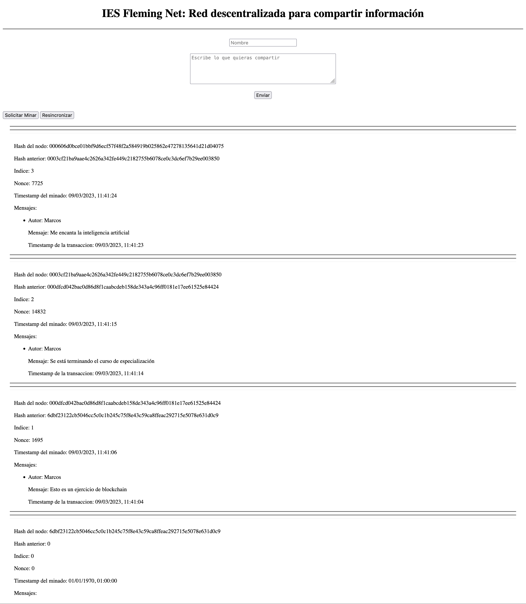
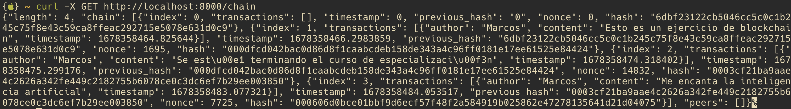
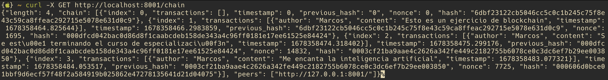
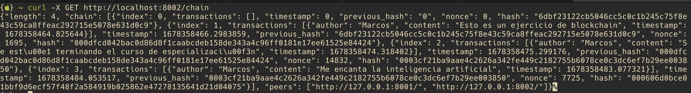
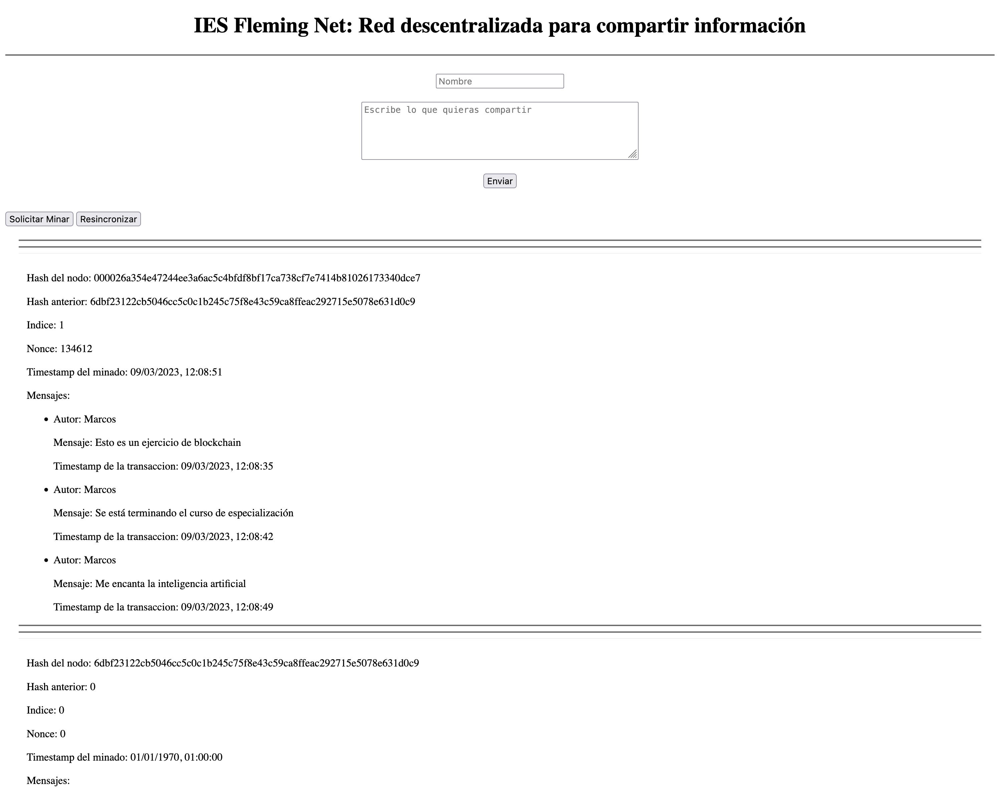

# Examen sobre la aplicación Python de blockchain

Sobre la práctica del sitio web simple que permitía a los usuarios compartir información mediante el uso de una blockchain que tenemos [aquí](https://github.com/mpajon/Ejercicio_Blockchain_Python).

Vamos a hacer unos pequeños cambios y extensiones para comprobar que hemos entendido el ejercicio.

---
# Ejercicio 1: Añadir un nuevo nodo a la cadena
---
En el ejercicio, se arranca un nodo en el puerto 8000 y otro en el puerto 8001 que se sincronizan y ambos nodos tienen la misma información en la cadena. 

Para ello deberias levantar la intefaz, el nodo 8000 y el nodo 8001. Además tienes que añadir el nodo 8001 a la cadena.

Una vez hecho, mina 3 bloques con tu nombre y los textos:

 - "Esto es un ejercicio de blockchain".
 - "Se está terminando el curso de especialización".
 - "Me encanta la inteligencia artificial".

> OJO: Son 3 bloques distintos, no un bloque con 3 mensajes.

Con estos 3 bloques minados, haz 3 capturas de pantalla con:

 - La interfaz con los bloques que has minado:

 - La información de los bloques en el nodo del puerto 8000 (tiene que verse el comando que has lanzado):

 - La información de los bloques en el nodo del puerto 8001 (tiene que verse el comando que has lanzado):

Puntuación: 0,25

Una vez hecho, levanta un nuevo nodo en el puerto 8002 y añadelo a la cadena. 

Haz una captura de pantalla con la información de los bloques en el nodo 8002 (tiene que verse el comando que has lanzado). 

El resultado debería ser el mismo en los 3 nodos.

Puntuación: 0,50

---
# Ejercicio 2: Aumenta la dificultad de la prueba de trabajo.
---

La dificultad de la prueba de trabajo que estamos usando está fijada en 3, es decir, los hash de los bloques comienzan por 3 ceros.

_¿Eres capaz de aumentar esta dificultad a 4 para que los hash de los bloques comiencen con 4 ceros?_ 

Genera 1 bloque con los mensajes anteriores:

 - "Esto es un ejercicio de blockchain".
 - "Se está terminando el curso de especialización".
 - "Me encanta la inteligencia artificial".

 Y mina el bloque. 

 > OJO: Es un único bloque.
 
 Haz una captura de pantalla de la interfaz donde se vea el hash generado y el *único bloque* con los mensajes.

 

 Puntuación: 0,25

